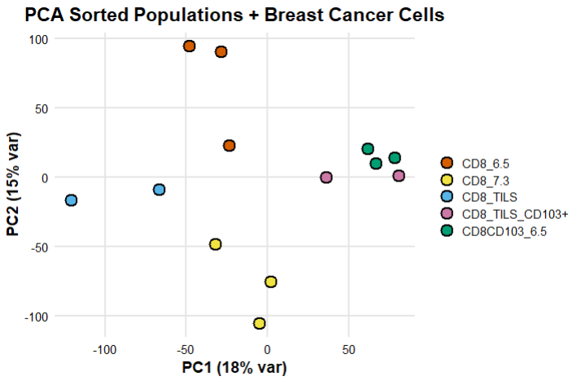

# 🧬 PCA analysis of sorted CD8+ T cells vs intratumoral CD8+CD103+ cells

This repository contains the code and output for a transcriptomic comparison between **experimental CD8+ T cell populations** (sorted from peripheral blood and treated in vitro) and **publicly available CD8+CD103+ tumor-infiltrating lymphocytes (TILs)** from breast cancer samples.

## 🔧 Analysis overview

- Gene-level counts were **normalized using variance-stabilizing transformation (VST)** via DESeq2.
- **Batch effects (donor identity)** were corrected using ComBat from the `sva` package.
- A **Principal Component Analysis (PCA)** was performed to explore transcriptional similarities between conditions.
- A custom condition label was applied to simplify interpretation of groups, distinguishing:
  - `CD8_6.5` and `CD8_7.3`: experimental blood-derived CD8+ T cells
  - `CD8CD103_6.5`: experimental CD8+CD103+ T cells
  - `CD8_TILS`, `CD8_TILS_CD103+`: tumor-infiltrating reference cells (from public dataset)

## 📊 Final PCA plot

> **Figure**: PCA of batch-corrected expression matrix. Each point represents a CD8+ T cell population. The plot reveals that the experimental CD8+CD103+ population clusters closely with the CD8+CD103+ TILs, suggesting transcriptional convergence.

## 📌 Conclusion

The analysis highlights that **in vitro–treated CD8+CD103+ T cells exhibit transcriptomic similarity to intratumoral CD8+CD103+ TILs**, supporting their potential as a model or therapeutic proxy for tumor-infiltrating cytotoxic lymphocytes.

## 📁 Contents

- `script/`: Contains the main PCA analysis code
- `figures/`: Final plot(s)

